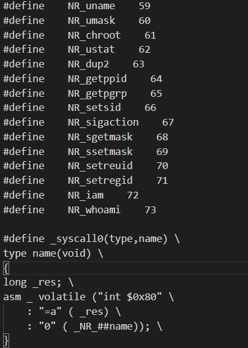
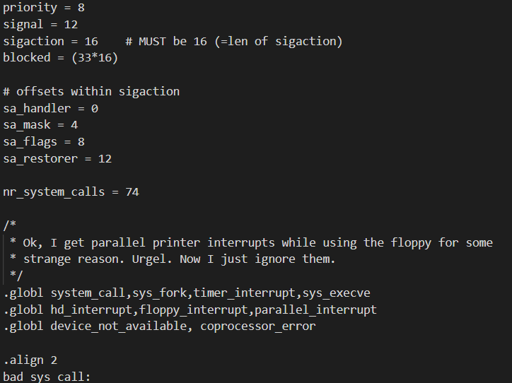
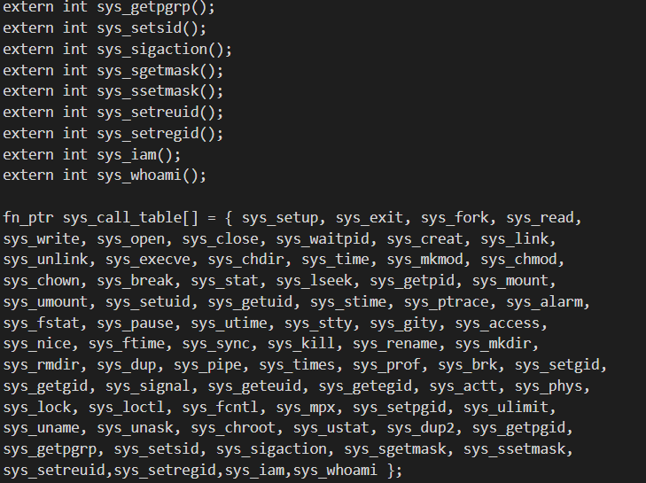
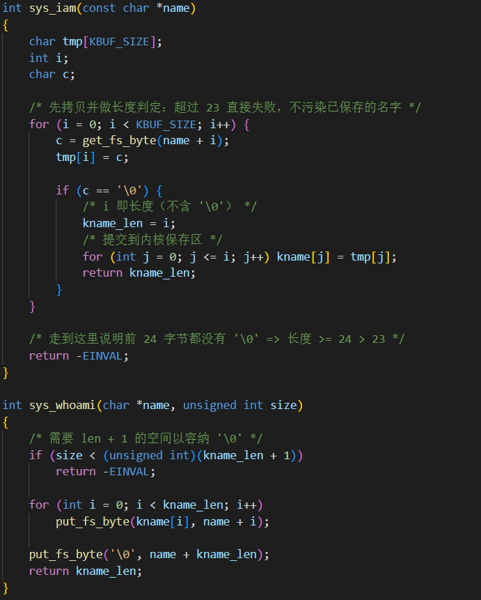
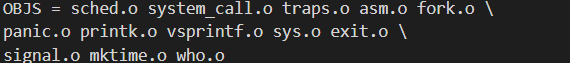
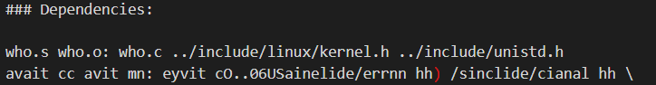
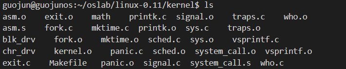
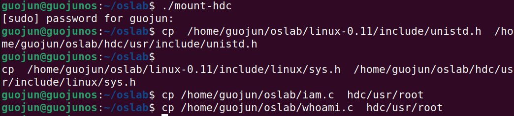
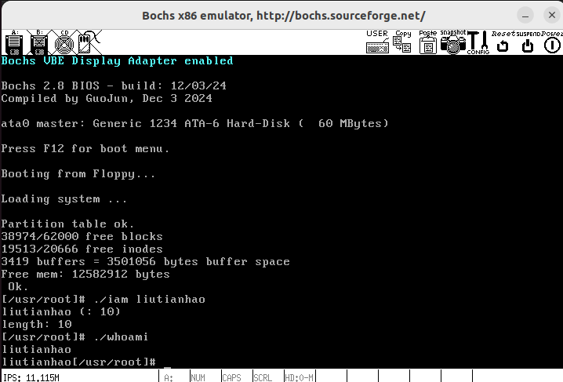

# 系统调用

**姓名：** 刘天浩 

**学号：** 2023113228

## 测试结果截图

- `testlab2.c`
>
> 
- `testlab2.sh`
>
> 

## 完整修改流程
## 3. 从零开始的完整修改流程（逐项列出所有改动点）

### 3.1 恢复 Linux 0.11 原始代码
- 根据实验要求，先将源码树恢复到“未做实验四改动”的干净状态（使用实验前留存的快照/备份恢复）。
- 该步骤的目标是避免实验三或其他实验残留改动干扰系统调用号、系统调用表或编译链接过程。

---

### 3.2 修改 include/unistd.h：新增系统调用号，并确认用户态 API 机制
1）在 linux-0.11/include/unistd.h 中新增系统调用号：
- Linux 0.11 现有系统调用号为 0~71，因此新增从 72 开始：
  - __NR_iam    72
  - __NR_whoami 73

2）同时可观察到 _syscall0/_syscall1/_syscall2... 宏的组织方式：它通过把系统调用号送入 EAX，并触发 int 0x80 进入内核。

- 显示新增的 __NR_iam / __NR_whoami，以及 _syscall 宏展开机制
  - 

说明：
- 用户态调用时，EAX 承载系统调用号（__NR_xxx），参数通过通用寄存器传递（见后续“内核入口与参数传递”小节）。
- 返回值从 EAX 带回；若为负值，用户态 API 将 errno 置为 -EAX，并向上返回 -1。

---

### 3.3 修改 kernel/system_call.s：更新系统调用总数 nr_system_calls
Linux 0.11 在 system_call 入口会检查系统调用号是否越界：
- cmpl $nr_system_calls-1, %eax
- 若超出范围则走 bad_sys_call

因此新增两个系统调用后，需要把系统调用总数从 72 更新为 74（即 0~73 共 74 个）。

- 关键改动：nr_system_calls = 74
- 显示 nr_system_calls 已更新为 74
  - 

---

### 3.4 修改 include/linux/sys.h：声明 sys_iam/sys_whoami，并挂接 sys_call_table
系统调用真正分发依赖 sys_call_table（函数指针数组）。system_call.s 会执行：
- call sys_call_table(, %eax, 4)

因此需要完成两件事：
1）在 sys.h 中增加函数声明，避免编译期“未声明”问题：
- extern int sys_iam();
- extern int sys_whoami();

2）在 sys_call_table[] 的末尾按编号顺序追加：
- 下标 72 -> sys_iam
- 下标 73 -> sys_whoami

- 显示 extern 声明与 sys_call_table 末尾追加 sys_iam/sys_whoami
  - 

---

### 3.5 新增 kernel/who.c：实现 sys_iam 与 sys_whoami
在 linux-0.11/kernel/who.c 中实现两个系统调用的内核侧逻辑。实现要点如下：

1）sys_iam(const char *name)
- 从用户态地址空间读取字符串：逐字节调用 get_fs_byte(name + i)
- 约束：name 长度不得超过 23
  - 实现方式：最多读 24 个字节（含 '\0'）
  - 若 24 字节内未遇到 '\0'，判定长度 ≥ 24 > 23，返回 -EINVAL
- 成功：把字符串复制到内核保存区并记录长度，返回长度（不含 '\0'）

2）sys_whoami(char *name, unsigned int size)
- size 必须至少为 (已保存长度 + 1) 才能容纳 '\0'
- 通过 put_fs_byte() 将内核保存区逐字节写回用户态缓冲区
- 成功返回长度（不含 '\0'），失败返回 -EINVAL

- sys_iam 与 sys_whoami 的核心实现代码段
  - 

补充说明：
- get_fs_byte/put_fs_byte 使用 FS 段寄存器访问用户态地址空间；system_call 入口会把 FS 切到用户态数据段选择子，从而保证跨态数据访问正确。

---

### 3.6 修改 kernel/Makefile：将 who.o 纳入编译与依赖
为了让 who.c 参与编译并链接入最终内核，需要修改 linux-0.11/kernel/Makefile：

1）在 OBJS 列表中追加 who.o（确保链接阶段包含该目标文件）
- OBJS 末尾出现 who.o
  - 

2）在 Dependencies 中加入 who.c 的依赖规则（保证修改 who.c 或相关头文件时可触发重编译）
- who.s/who.o 的依赖项
  - 

3）执行 make 后确认 who.o 已生成并位于 kernel 目录
- kernel 目录 ls 显示 who.c 与 who.o 同时存在
  - 

---

### 3.7 挂载 hdc 文件系统并拷贝用户态头文件与测试程序
为了在 Linux 0.11 环境中编译运行测试程序，需要将相关文件拷贝进镜像文件系统：

1）挂载 hdc：
- 执行：./mount-hdc

2）解决用户态头文件不含新增系统调用号的问题：
- Linux 0.11 运行时使用 /usr/include 下的头文件；其中 /usr/include/unistd.h 可能不含 __NR_iam/__NR_whoami。
- 因此将修改后的 include/unistd.h 拷贝进 hdc 的 /usr/include/unistd.h（或以实验环境脚本方式覆盖）。

3）为 testlab2.c 的内核侧评分与用户态脚本评分准备：
- 将 include/linux/sys.h 拷贝到 hdc 的 /usr/include/linux/sys.h（按实验环境需要）。
- 将 iam.c、whoami.c 拷贝到 hdc 的 /usr/root（便于在 0.11 中直接编译运行）。

- mount-hdc 成功、以及 cp 拷贝 unistd.h / sys.h / iam.c / whoami.c 的命令与路径
  - 

---

### 3.8 启动 Bochs 运行修改后的 Linux 0.11，并进行功能验证
1）在 Bochs 中启动系统，进入 /usr/root
2）编译并运行测试程序（示例流程）：
- gcc -o iam iam.c -Wall
- gcc -o whoami whoami.c -Wall
- ./iam <name>
- ./whoami

3）效果验证：
- iam 写入内核保存区
- whoami 能正确读出并打印保存的名字

- Bochs 启动日志、./iam 写入、./whoami 输出，结果与预期一致
  - 

---

## 回答如下问题：

### 1. 从 `Linux 0.11` 现在的机制看，它的系统调用最多能传递几个参数？

> 结论：最多能传递 **3 个参数**。  
> 原因：Linux 0.11 的系统调用入口约定中，`EAX` 用于存放系统调用号并在返回时携带返回值；而参数通过通用寄存器传递，常规实现只使用 `EBX / ECX / EDX` 分别传递第 1/2/3 个参数。  
> 进入内核的 `system_call` 例程也只对 `EBX、ECX、EDX` 做了压栈与参数保留（与实验提示中 `pushl %edx; pushl %ecx; pushl %ebx` 一致），因此现有机制下系统调用“直接寄存器传参”的上限为 3 个。

### 2. 你能想出办法来扩大这个限制吗？

> 可以。常见做法有两类（本质上是“扩展寄存器传参”或“改为内存传参”）：
>
> 1）扩展系统调用传参约定（扩展寄存器数量）  
> - 修改 `kernel/system_call.s`：在进入内核时额外保存更多寄存器（例如 `ESI/EDI/EBP` 等），并在调用具体 `sys_xxx` 前把它们也按 C 调用约定组织到栈上/或约定为额外参数来源。  
> - 修改用户态 `include/unistd.h`：新增 `_syscall4/_syscall5/...` 宏，在触发 `int 0x80` 前把第 4/5/... 个参数装入新约定的寄存器。  
> - 同步修改对应 `sys_foo` 的函数原型与参数读取方式。  
> 该方案改动面较大，且需要保证与现有系统调用 ABI 的一致性或兼容策略。
>
> 2）使用“参数块指针”绕开数量上限（推荐思路，改动面小）  
> - 仍只通过寄存器传递少量参数（通常 1 个指针参数即可）：用户态把所有参数打包成一个结构体（或数组），把该结构体的用户态地址作为参数传入系统调用。  
> - 内核态通过 `get_fs_byte/get_fs_long/...` 从该指针指向的用户空间结构体读取各字段。  
> 这样“系统调用接口参数个数”仍不变，但“逻辑参数数量”可以扩展到任意多，同时更便于版本演进（增加字段即可）。

### 3. 用文字简要描述向 `Linux 0.11` 添加一个系统调用 `foo()` 的步骤。

> 可以按“编号分配 → 入口检查 → 调用表挂接 → 内核实现 → 编译链接 → 用户态验证”的顺序完成：
>
> 1）分配系统调用号  
> - 在 `linux-0.11/include/unistd.h` 中新增 `__NR_foo`（取当前最大号之后的下一个值）。  
> - 如该文件中存在系统调用总数宏（不同资料可能写法略有差异），同步把总数 +1。
>
> 2）更新系统调用总数检查  
> - 在 `linux-0.11/kernel/system_call.s` 中将 `nr_system_calls` 增加 1，保证 `cmpl $nr_system_calls-1, %eax` 的越界检查仍正确。
>
> 3）在系统调用表中注册  
> - 在 `linux-0.11/include/linux/sys.h` 中声明：`extern int sys_foo();`  
> - 在 `sys_call_table[]` 中按编号顺序把 `sys_foo` 插入到对应下标位置（确保 `__NR_foo` 与数组下标严格一致）。
>
> 4）实现内核侧系统调用处理函数  
> - 选择合适目录实现 `int sys_foo(...)`：可以新建 `kernel/foo.c` 或放入对应模块文件。  
> - 若参数包含用户态指针（如字符串/缓冲区），使用 `get_fs_byte/get_fs_long/...` 从用户空间读，使用 `put_fs_byte/put_fs_long/...` 写回用户空间，避免直接解引用用户指针导致跨地址空间访问错误。  
> - 失败时返回负错误码（如 `-EINVAL`），由用户态 API 转换成 `errno` 并返回 -1。
>
> 5）修改 Makefile 使其参与编译链接  
> - 在对应目录的 `Makefile`（例如 `kernel/Makefile`）中把 `foo.o` 加入 `OBJS`。  
> - 在 `### Dependencies` 中补充 `foo.c` 的依赖规则，保证增量编译正确。
>
> 6）编译内核并在 0.11 环境中验证  
> - `make all` 重新生成内核映像并启动 Linux 0.11。  
> - 编写用户态测试程序：在用户程序中 `#define __LIBRARY__`，`#include <unistd.h>`，并用 `_syscallN` 定义 `foo()` 的 API；随后在 0.11 下 `gcc -o test test.c -Wall` 编译运行。  
> - 最后用评分脚本或自测用例覆盖边界条件与错误路径，确认 `errno` 与返回值行为符合约定。

## （可选）总结与反思

本次实验的核心在于贯通 “用户态 API → int 0x80 入口 → system_call 分发 → sys_call_table 跳转 → sys_xxx 实现 → 返回值/errno 回传” 的完整链路，并在实践中明确了 Linux 0.11 的传参约定（EAX 号 + EBX/ECX/EDX 三参）与用户/内核地址空间隔离机制（通过 FS 段与 `get_fs_* / put_fs_*` 访问用户空间）。  
实现层面最容易出错的点通常集中在三处：系统调用号与 sys_call_table 下标是否严格一致、`nr_system_calls` 是否同步更新、以及对用户态指针是否通过 `get_fs_* / put_fs_*` 访问并做足边界检查（长度与缓冲区容量）。通过对 23/24 字符边界、size 不足等测试用例的覆盖，可以显著提升对系统调用鲁棒性与错误返回语义的理解，也为后续涉及用户态缓冲区交互的实验打下基础。

