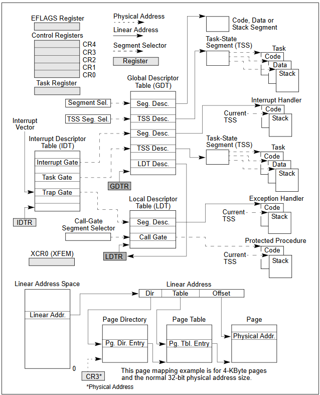

# x86系统架构读书报告

**姓名：** 刘天浩 

**学号：** 2023113228  

---

---

## 1. x86系统架构概览

### 1.1. 系统级体系结构概览

x86 的系统级架构由多种硬件与控制机制组成，用于支持分段、分页、多任务和异常中断等操作系统核心功能。主要组成部分包括：

- **Global Descriptor Table (GDT)**：存储全局段描述符，是内存分段机制的基础。  
- **Local Descriptor Table (LDT)**：为特定任务提供独立的段描述符集合，实现任务隔离。  
- **System Segments 与 Gates**：用于访问系统级结构，如 Task-State Segment (TSS)、调用门 (Call Gate) 等。  
- **Interrupt & Exception Handling**：通过中断描述符表（IDT）进行统一管理。  
- **Task-State Segment (TSS)**：保存任务寄存器状态与特权栈信息，用于任务切换。  
- **Control Registers (CR0–CR4)**：控制分页、保护模式、缓存、调试等系统行为。  
- **Memory Management (Paging)**：通过页目录、页表、页项的层级结构将线性地址映射到物理地址。

这些模块共同构建了一个安全、可多任务、具备虚拟内存管理的执行环境，是操作系统内核运行的硬件基础。

进一步理解这一体系时，可以将CPU视为多个“层级协作”的控制模块：  
1. **寄存器层（Register Layer）**：负责暂存操作数、地址和状态信息，是CPU与内存交互的核心；  
2. **描述符层（Descriptor Layer）**：由GDT、LDT、IDT等组成，为段和中断提供逻辑地址的描述与保护边界；  
3. **分页层（Paging Layer）**：通过CR3寄存器所指的页目录与页表，实现线性地址与物理地址的映射；  
4. **任务层（Task Layer）**：TSS记录了任务的寄存器状态、特权级栈等，实现任务的快速切换与隔离；  
5. **中断与异常层（Interrupt Layer）**：通过IDT响应硬件中断与软件异常，保证系统实时性与安全性。

这一体系保证了IA-32架构既能兼容8086旧体系，又能支撑现代操作系统的保护与多任务机制。

---

### 1.2. 实模式和保护模式转换

#### 1.2.1. IA-32支持哪些操作模式？

>IA-32架构支持以下几种主要模式：
>
>1. **实模式（Real Mode）**：  
   兼容8086，寻址范围1MB，采用段:偏移寻址方式，无内存保护机制。所有程序共享物理内存空间，适用于启动阶段和早期引导。  
>2. **保护模式（Protected Mode）**：  
   支持分段与分页，32位寻址空间（4GB），具备多任务、特权级保护与虚拟内存机制。现代操作系统（如Windows、Linux）均运行于此模式。  
>3. **虚拟8086模式（V8086 Mode）**：  
   允许在保护模式下运行8086程序，为兼容旧系统提供环境。由EFLAGS寄存器的VM位控制。  
>4. **系统管理模式（SMM）**：  
   由硬件触发（SMI信号），进入独立的系统管理RAM区域，用于节能管理、安全恢复、BIOS级控制等。

#### 1.2.2. 处理器如何在不同操作模式之间切换？

>- **实模式 → 保护模式**：通过设置CR0寄存器中的PE位实现（CR0.PE = 1）。  
>- **保护模式 → 虚拟8086模式**：通过设置EFLAGS.VM = 1，并确保特权级允许。  
>- **保护模式 → SMM**：由外部硬件信号SMI触发，进入系统管理空间。  
>- **返回路径**：执行RSM指令从SMM返回；通过修改CR0.PE和EFLAGS.VM可回到其他模式。
>
>这种模式切换机制使得CPU既能运行早期BIOS代码，又能执行多任务操作系统。

#### 1.2.3. 如何从实模式切换到保护模式？

>1. **关闭中断（CLI）**：防止模式切换时被中断打断；  
>2. **建立GDT表**：创建段描述符，并通过`LGDT`加载到GDTR；  
>3. **设置CR0寄存器的PE位**：执行`mov eax, cr0`，`or eax, 1`，`mov cr0, eax`启用保护模式；  
>4. **执行远跳转（JMP FAR）**：刷新CPU流水线并加载新的CS选择子；  
>5. **重新加载段寄存器（DS、ES、SS、FS、GS）**；  
>6. **启用分页（可选）**：若要进入完整保护模式，需建立页表并设置CR3、打开CR0.PG位。

#### 1.2.4. 从保护模式切换回实模式

>1. **关闭分页**：清除CR0.PG位；  
>2. **清除保护位**：`and eax, 0xFFFFFFFE`，写回CR0，关闭PE；  
>3. **远跳转**：刷新CS寄存器，确保CPU执行流在实模式下；  
>4. **恢复中断与段寄存器**。

---

### 1.3. 80x86系统寄存器

#### 1.3.1. 标志寄存器 (EFLAGS)

EFLAGS寄存器包含系统状态与控制标志：

>| 标志位 | 名称 | 功能描述 |
>|---------|------|-----------|
>| IF | Interrupt Flag | 控制中断响应；0禁止外部中断，1允许中断 |
>| IOPL | I/O Privilege Level | 控制I/O指令可执行的特权级别 |
>| NT | Nested Task | 标记任务嵌套调用 |
>| RF | Resume Flag | 调试用，防止断点重复触发 |
>| VM | Virtual 8086 Mode | 启用虚拟8086模式 |
>| AC | Alignment Check | 检查内存对齐错误 |
>| ID | Identification Flag | 允许检测CPU ID |
>| TF, DF, OF, SF, ZF, PF, CF | 各种算术/逻辑结果标志 |
>
>这些标志位在操作系统任务切换、异常响应与调试中起到关键作用。

#### 1.3.2. 内存管理寄存器 (GDTR, LDTR, IDTR, TR)
- 请分别解释GDTR, LDTR, IDTR, TR这四个寄存器存储的内容是什么？有什么作用？
>| 寄存器 | 功能 | 内容 |
>|---------|------|------|
>| **GDTR** | 指向全局描述符表 | 存储GDT的基地址与界限 |
>| **LDTR** | 指向局部描述符表 | 记录当前任务使用的LDT地址 |
>| **IDTR** | 指向中断描述符表 | 保存IDT的基址与界限，用于异常与中断 |
>| **TR** | 任务寄存器 | 保存当前任务的TSS选择子 |

#### 1.3.3. 控制寄存器 (CR)
- CR的用途是什么？

>控制寄存器用于控制系统特性。  
- CR0-CR3的具体功能是什么？
>- **CR0**：控制保护模式、分页、缓存与协处理器功能。  
>- **CR1**：保留未使用。  
>- **CR2**：保存触发页错误的线性地址。  
>- **CR3**：页目录基址寄存器（PDBR），指向页目录表。  
>- **CR4**：控制扩展功能，如虚拟8086扩展、页大小扩展（PSE）等。
>
>这些寄存器直接决定CPU运行模式与地址变换机制，是保护模式核心组成部分。

---

### 1.4. 系统指令
#### 1.4.1. 请解释以下系统指令的功能和用途。
>| 指令 | 功能与用途 |
>|------|-------------|
>| **LGDT** | 将内存中的全局描述符表（GDT）基址与界限加载到GDTR。 |
>| **SGDT** | 将当前GDTR内容保存到内存。 |
>| **LIDT** | 将中断描述符表（IDT）基址加载到IDTR。 |
>| **SIDT** | 将当前IDTR内容保存到内存。 |
>| **LLDT** | 将局部描述符表（LDT）选择子加载到LDTR。 |
>| **SLDT** | 将当前LDTR内容保存到内存。 |
>| **LTR** | 将任务状态段（TSS）选择子加载到任务寄存器（TR）。 |
>| **STR** | 将当前任务寄存器内容保存到内存。 |
>
>这些系统指令构成了操作系统启动、任务切换与中断处理的底层基础。

---

### 总结与反思

通过本次学习，我深刻理解了x86体系结构的复杂性与精妙性。从最初的8086实模式，到现代32位保护模式，其演化体现了从“裸机控制”向“多层保护与抽象”的转变。  

保护模式的关键在于：
1. 通过GDT和LDT实现分段隔离；  
2. 通过IDT实现统一中断管理；  
3. 通过TSS与任务寄存器实现多任务调度；  
4. 通过分页机制实现虚拟内存与物理内存的解耦。  

这些机制共同构建了现代操作系统赖以运行的硬件抽象层。  
在阅读与理解过程中，最大的难点是**描述符与寄存器之间的交互逻辑**，尤其是GDTR、IDTR、TR之间的关联。但通过图示（如图2.1），这种逻辑关系得以清晰化。  

未来我希望进一步探究：  
- 如何在保护模式下手动实现任务切换；  
- 如何通过分页机制模拟用户空间与内核空间的隔离；  
- 以及如何在汇编层级构建一个最小的内核。  

这不仅是汇编学习的延伸，更是深入理解操作系统设计理念的重要一步。

---
