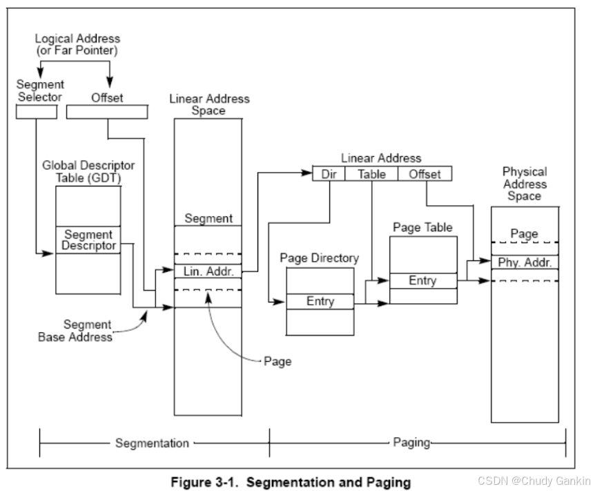
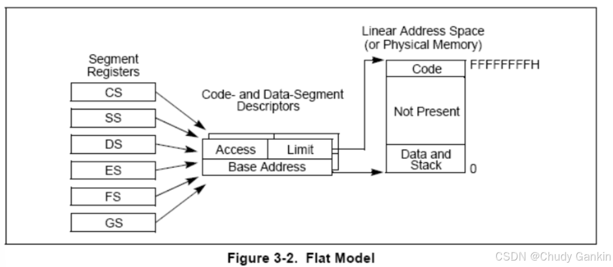
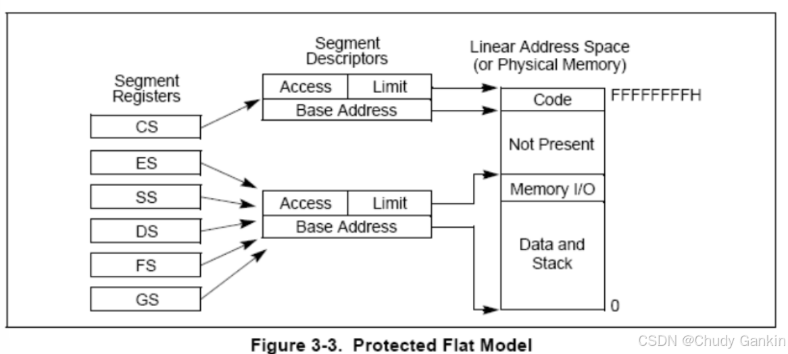
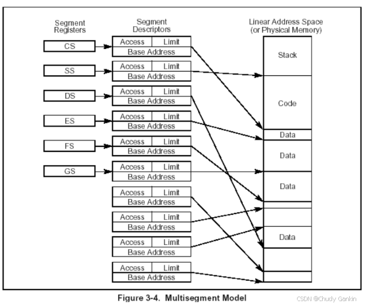

# 保护模式内存管理

**姓名：** 刘天浩

**学号：** 2023113228

## 2.1 内存管理概览

### **2.1.1 地址空间**

*（有关分段管理的内容一定要掌握，有关分页的内容会在以后的课程中详细介绍。）*

- 请分别解释逻辑地址 (Logical Address)、线性地址 (Linear Address) 和物理地址 (Physical Address) 的定义是什么？

  > 逻辑地址（Logical Address）由**段选择子（Segment Selector）**和**段内偏移（Offset）**组成，是程序员在汇编代码中可见的地址形式。  
  > 线性地址（Linear Address）是经过段选择子访问段描述符、由段基址与偏移量相加得到的“虚拟地址”，表示内存中的线性连续空间。  
  > 物理地址（Physical Address）是最终被送入**内存总线**的地址，用于访问真实的内存单元。  
  >
  > 在启用分页机制前，线性地址即为物理地址；启用分页后，线性地址需通过页表转换为物理地址。  
  > 

- 简述这三者之间是如何转换的？

    > 程序访问内存时，首先生成逻辑地址：`段选择子:偏移量`。  
    > 处理器通过段选择子在 **GDT/LDT** 中找到对应的段描述符，读取段基址，与偏移量相加得到线性地址。  
    > 若分页未启用，则线性地址直接作为物理地址使用；若分页启用，则线性地址需通过页目录（Page Directory）和页表（Page Table）进行二级转换，得到最终的物理地址。  
    >
    > 因此整个过程为：**逻辑地址 → 段转换 → 线性地址 → 分页机制 → 物理地址**。  
    > 
  
  

## 2.2 分段机制

### **2.2.1 分段模型**

- Basic Flat Model
- Protected Flat Model
- Multi-Segment Model
  > Basic Flat Model：整个地址空间仅使用一个段，段基址为0，界限覆盖全部4GB，所有程序共享同一线性地址空间，适合现代OS使用。
  
  >
  > Protected Flat Model：类似平坦模型，但在保护模式下，每个段仍通过描述符表（GDT）受到访问控制与特权保护。
  
  >  
  > Multi-Segment Model：将代码、数据、堆栈等分别放入不同段中，通过不同段描述符实现隔离与保护，是早期操作系统常用模型。  
    
  

## 2.3 逻辑地址和线性地址的转换

### **2.3.1 段选择子 (Segment Selectors)**

- 段选择子由哪几部分组成？请分别解释各部分作用。

  > 段选择子为16位，由三部分组成：  
  > 1. **索引（Index, 13位）**：指明该段描述符在GDT或LDT表中的位置；  
  > 2. **TI位（Table Indicator, 1位）**：指示描述符来源，0表示GDT，1表示LDT；  
  > 3. **RPL（Request Privilege Level, 2位）**：请求特权级，表示当前任务访问此段时的权限等级。  
  >
  > CPU通过段选择子快速定位段描述符，实现地址转换与特权控制。  
  > 

### **2.3.2 段寄存器 (Segment Registers)**

- 段寄存器为何要设计为包含“可见部分”和“隐藏部分”（描述符缓存）？

  > 因为每次访问内存时若都查询GDT/LDT将严重影响性能。  
  > 因此，段寄存器由两部分组成：  
  > - **可见部分（Visible Part）**：存储段选择子；  
  > - **隐藏部分（Hidden Part / Descriptor Cache）**：自动缓存该选择子对应段描述符的基址、界限与属性。  
  >
  > 这样在段寄存器加载后，CPU可直接使用缓存的描述符进行地址变换，无需每次重新访问GDT或LDT，提高执行效率。  
  > 

- 处理器可以使用哪几种加载指令完成对段寄存器的加载？

  > 段寄存器的加载通常通过以下指令完成：  
  > - **MOV 指令**：将段选择子直接加载到段寄存器（如 `MOV DS, AX`）；  
  > - **POP 指令**：从栈中弹出值装入段寄存器；  
  > - **LDS/LES/LFS/LGS/LSS 指令**：一次加载段寄存器与偏移量；  
  > - **任务切换**或**中断调用门**：自动更新段寄存器内容。  
  >
  > 

### **2.3.3 段描述符 (Segment Descriptors)**

- 段描述符的作用是什么？

  > 段描述符定义了一个段在内存中的**位置（基址）**、**大小（界限）**和**访问权限**。  
  > 它是保护模式中进行地址变换与内存保护的核心结构。  
  >
  > 每个描述符长8字节，由系统保存在GDT或LDT中。  
  > 

- 段描述符的通用格式是什么？

  > 通用格式如下（共64位）：  
  > - **Base Address（基址）**：32位，段的起始物理地址；  
  > - **Limit（界限）**：20位，定义段的大小；  
  > - **Type / S / DPL / P**：段类型、系统标志、特权级和存在位；  
  > - **AVL / L / D / G**：可用位、64位标志、默认操作数大小、粒度位。  
  >
  > 界限单位可为字节（G=0）或4KB（G=1），用于扩大段容量。  
  > 

- 简述段描述符中的关键标志位和字段的含义用途。

  > - **Base**：段基址；  
  > - **Limit**：段长度；  
  > - **G（Granularity）**：粒度位，0为字节，1为4KB；  
  > - **D/B**：默认操作数大小，1为32位段；  
  > - **DPL（Descriptor Privilege Level）**：描述符特权级；  
  > - **P（Present）**：存在位，1表示该段有效；  
  > - **S（System）**：0为系统段描述符，1为代码/数据段描述符；  
  > - **Type**：段类型，如可执行、可写、可读等。  
  >
  > 这些标志位共同实现了访问权限和地址空间的保护机制。  
  > 

### **2.3.4 转换过程**

- 请综合以上概念，详细描述处理器将一个逻辑地址转换为线性地址的完整步骤。

  > 1. 程序给出逻辑地址（段选择子:偏移量）；  
  > 2. 处理器读取段选择子，从中提取索引、TI、RPL；  
  > 3. 若TI=0，则在GDT中查找描述符；若TI=1，则在LDT中查找；  
  > 4. CPU将段描述符加载到段寄存器的隐藏部分（缓存）；  
  > 5. 检查权限与界限，若合法，则取段基址与偏移量相加，得到线性地址；  
  > 6. 若分页开启，线性地址继续通过页目录与页表转换为物理地址。  
  >
  > 此转换流程在每次内存访问中自动进行，是保护模式内存访问的核心机制。  
  > 

## 2.4 描述符的分类

**重点掌握有关描述符以下内容：**
- 数据段描述符 Data segment Descriptor
- 代码段描述符 Code segment Descriptor
- 局部描述符表描述符 Local descriptor-table (LDT) segment descriptor
- 任务状态段描述符 Task-state segment (TSS) descriptor
- 调用门描述符 Call-gate descriptor
- 中断门描述符 Interrupt-gate descriptor
- 陷阱门描述符 Trap-gate descriptor
- 任务门描述符 Task-gate descriptor

  > 各类描述符在GDT或LDT中占8字节，通过标志位S、Type区分。  
  > 数据段与代码段用于定义程序访问区；系统段（如TSS、门描述符）用于任务切换与中断处理。  
  > 每种描述符都对应不同的结构与权限控制逻辑。  
  > 

### **2.4.1 代码段与数据段描述符**

- S标志位是多少时，段描述符指向代码或数据段？如何区分描述符是用于代码段还是数据段？

  > 当 **S = 1** 时，表示该描述符是**代码段或数据段描述符**。  
  > 通过 **Type 字段**进一步区分：  
  > - Type 第3位（E位）=1 → 代码段；  
  > - Type 第3位（E位）=0 → 数据段。  
  >
  > 此外，代码段可读但不可写，数据段可读写但不可执行。  
  > 

- 叙述代码和数据段类型字段中位编码的整体含义。

  > **数据段Type字段（4位）**：  
  > - 位0：A（Accessed）标志；  
  > - 位1：W（Writable）；  
  > - 位2：E（Expand Down）；  
  > - 位3固定为0。  
  >
  > **代码段Type字段（4位）**：  
  > - 位0：A（Accessed）；  
  > - 位1：R（Readable）；  
  > - 位2：C（Conforming，服从型）；  
  > - 位3固定为1。  
  >
  > 不同组合实现对执行、访问、共享的灵活控制。  
  > 

### **2.4.2 系统描述符**

- 当S标志位为多少时，描述符被定义为系统描述符？

  > 当 **S = 0** 时，表示该描述符为系统描述符（System Segment Descriptor）。  
  > 系统描述符包括TSS、LDT、各种“门”描述符（Gate Descriptor）等。  
  > 

- 系统描述符主要分为哪几大类？请列举每类中包含的具体描述符类型及其作用。

  > 系统描述符可分为以下几类：  
  > 1. **任务管理类**：任务状态段（TSS）描述符，用于保存任务寄存器状态，实现硬件任务切换；  
  > 2. **表类**：局部描述符表（LDT）描述符，定义每个任务的局部段空间；  
  > 3. **门类（Gate Descriptors）**：  
  >    - **调用门（Call Gate）**：用于在不同特权级间调用子程序；  
  >    - **中断门（Interrupt Gate）**：在中断时转移控制并关闭中断标志；  
  >    - **陷阱门（Trap Gate）**：类似中断门，但不关闭中断标志；  
  >    - **任务门（Task Gate）**：通过任务切换机制响应中断或调用。  
  >
  > 这些描述符协同工作，使保护模式支持多任务、异常处理与特权隔离等复杂系统功能。  
  > 

## （可选）总结与反思

> 通过本章学习，我理解了保护模式下分段机制的核心思想——在物理地址与程序逻辑之间建立“可控映射”。  
> 逻辑地址通过描述符表映射到线性地址，再经分页映射到物理地址，从而实现了内存隔离与特权保护。  
> 现代操作系统虽然采用平坦模型弱化了分段，但其原理仍是理解CPU保护机制的基础。  
> 理解段寄存器的隐藏部分与GDT/LDT结构，是掌握保护模式的关键所在。  
> 

