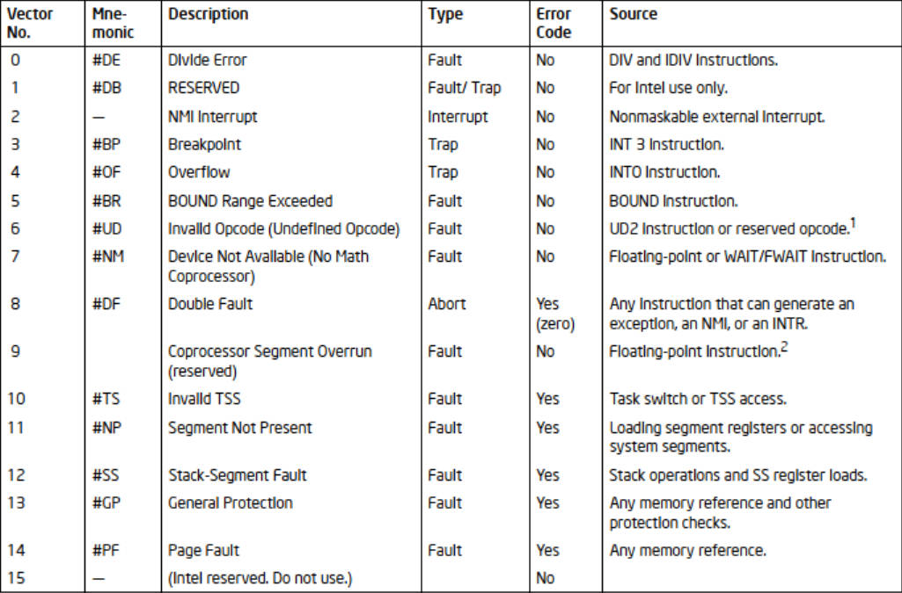
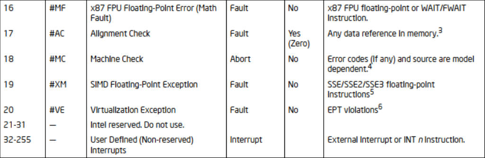
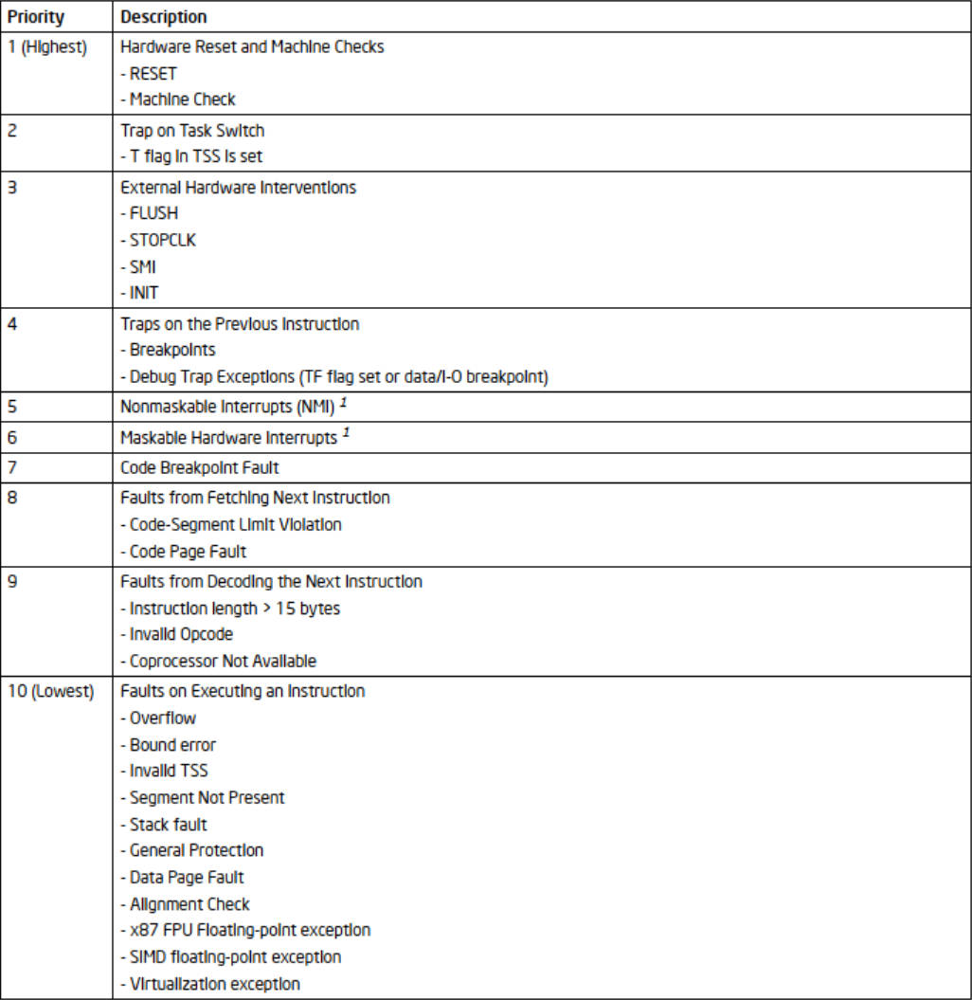
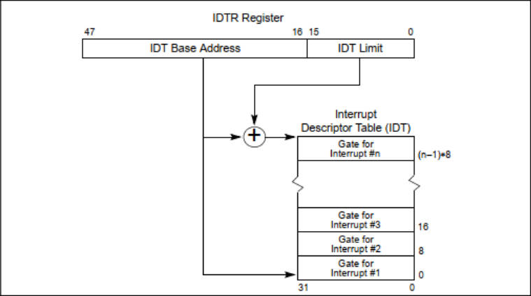
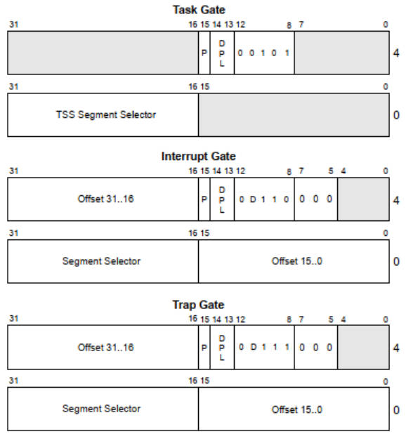

# 中断和异常处理

**姓名：** 刘天浩

**学号：** 2023113228

## 3.1 中断和异常处理概述

### **3.1.1 中断和异常**

- 什么是中断 (Interrupt)？什么是异常 (Exception)？两者在触发原因上有何根本不同？

> - 中断（Interrupt）由来自处理器外部的硬件设备触发，是**异步事件**，如键盘、定时器、网卡、硬盘发出的信号。  
> - 异常（Exception）则是由**处理器内部**在执行指令的过程中检测到错误或特殊条件而触发，是**同步事件**，如除零错误、缺页、无效操作码等。  
> 
> 它们的根本区别在于触发源不同：中断来自外部硬件，异常来自指令执行内部。  

图1 保护模式中段和异常1

图2 保护模式中段和异常2

## 3.2 中断与异常的关键属性

### **3.2.1 中断和异常向量**

- 什么是中断/异常向量？处理器如何使用它来识别不同的中断和异常事件？

> - 中断/异常向量是一个 **0–255 的索引号**，用于在中断描述符表（IDT）中查找对应的表项。  
> - CPU 根据向量号从 IDT 中取出该事件对应的门描述符，其中包含处理程序的段选择子和偏移量。  从而 CPU 能区分不同类型的中断和异常并跳转到相应的处理程序。  
>
>

### **3.2.2 中断源和异常源**

- 请列举中断和异常的几种主要来源。

> **中断来源：**  
> - 外设硬件（键盘、鼠标、硬盘、定时器等）  
> - 可屏蔽中断（PIC/APIC）  
> - 不可屏蔽中断 NMI  
>
> **异常来源：**  
> - 指令执行错误（如除零错误、溢出）  
> - 保护错误（段越界、特权级错误）  
> - 内存错误（缺页异常）  
> - 调试事件（断点、单步执行）  
> - 软件触发（INT n 指令）  
>
>

### **3.2.3 异常的分类**

- 异常被分为哪几类？请分别解释故障 (Fault)、陷阱 (Trap) 和中止 (Abort) 的特点，以及处理器在遇到它们后，返回地址EIP指向的位置有何不同。

> **Fault（故障）**：  
> - 可恢复性异常  
> - 返回时 EIP 指向**引发异常的指令本身**（用于重试）  
> - 示例：缺页异常  
>
> **Trap（陷阱）**：  
> - 调试类异常  
> - 返回时 EIP 指向**下一条指令**  
> - 示例：断点、中断指令  
>
> **Abort（中止）**：  
> - 严重不可恢复错误  
> - 返回地址不保证有效  
> - 示例：机器检查异常  
>
>

图3 同时异常和中断的优先级

## 3.3 中断描述符表

### **3.3.1 IDT 的结构与定位**

- IDT 是如何构成的？

> IDT 由最多 256 个表项组成，每个表项大小为 8 字节。  
> 每个表项是一个 **门描述符（中断门、陷阱门或任务门）**，包含处理程序入口地址、段选择子、类型属性和权限信息。  
>
>

- 如何获得中断处理程序的地址？

> CPU 根据向量号查找 IDT 表项，从门描述符中读取：  
> - 处理程序的偏移地址（Offset）  
> - 处理程序所在的代码段选择子（CS Selector）  
> 将二者组合成最终跳转地址。  
>
>

- 如何设置中断描述符表寄存器？

> 使用 `LIDT` 指令将 IDT 的基地址和界限加载到 IDTR 寄存器中，从而启用新的中断描述符表。  
>
>

## 3.4 IDT 门描述符

### **3.4.1 门描述符类型**

- 简述中断门 (Interrupt Gate)、陷阱门 (Trap Gate) 和任务门 (Task Gate) 的结构和用途。三者的区别有哪些？

> **中断门（Interrupt Gate）**：  
> - 调用时 CPU 自动清除 IF 位，禁止后续中断  
> - 主要用于普通硬件中断  
>
> **陷阱门（Trap Gate）**：  
> - 调用时不清除 IF  
> - 常用于系统调用或调试异常  
>
> **任务门（Task Gate）**：  
> - 指向一个 TSS 选择子  
> - 触发硬件任务切换  
>
> 区别：  
> - 中断门会清除 IF；陷阱门不会  
> - 任务门不是跳转到代码段，而是执行任务切换  
>
>

## 3.5 中断与异常处理流程

- 中断过程调用的流程是怎样的？

> 1. CPU 获取中断/异常向量号  
> 2. 通过 IDT 查找对应的门描述符  
> 3. 检查特权级，决定是否执行堆栈切换  
> 4. 压栈现场（EFLAGS、CS、EIP，还有错误码）  
> 5. 加载新的 CS 和 EIP，跳转到处理程序入口  
>
>

- 如果发生堆栈切换，处理器会做哪些操作？

> 1. 从当前任务的 TSS 中读取新特权级的 SS 和 ESP  
> 2. 切换至新栈后压入旧 SS 和旧 ESP  
> 3. 再压入 EFLAGS、CS、EIP、错误码  
>
>

- 如果没发生堆栈切换，处理器会做哪些操作？

> 在当前堆栈直接依次压入：  
> - EFLAGS  
> - CS  
> - EIP  
> - 错误码（若对应异常存在错误码）  
>
>

- 中断处理过程后，如何返回，处理器做了哪些操作？

> 使用 `IRET` 指令，从栈中弹出：  
> 1. EIP（返回指令地址）  
> 2. CS（代码段）  
> 3. EFLAGS  
> 若发生过堆栈切换，还会恢复 SS 和 ESP。  
>
>

- 中断门与陷阱门的唯一区别是什么？

> 中断门调用后 CPU 自动清除 IF 位（禁止中断），陷阱门不会修改 IF 位（保持可中断）。  
>
>

图4 IDTR（中断描述符表寄存器）和 IDT（中断描述符表）的关系

图5 IDT门描述符

## 总结与反思

> 本章帮助我理解操作系统如何管理外部硬件事件与内部异常处理机制。  
> IDT、门描述符和 TSS 在硬件层面协作实现了可靠的中断响应流程。  
> 中断门与陷阱门的差别也揭示了 OS 对可重入性和调试逻辑的精细控制。  